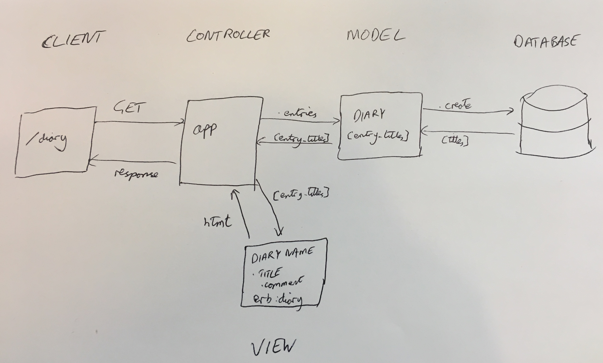

# Daily Diary Application

In this project I will build a 'Daily Diary' web app that uses Sinatra together with a PostgreSQL to store diary entries, and has a browser-based user interface.

The full instructions I was given for this project can be found in `project-instructions.md`.

## Set-up

### Download and run Daily Diary app

In the command line enter the following:

```sh
$ git clone git@github.com:rhysco8/daily-diary-project.git
$ cd daily-diary-project
$ bundle
$ rackup
```

### Database

1. Connect to psql (`psql` in the command line)
2. Create the database
```
# CREATE DATABASE daily_diary;
```
3. Connect to the database
```
# \c daily_diary
```
4. Run the SQL scripts in `db/migrations` folder in the given order
5. Enter `\q` to exit

## Approach

I was provided with User stories in 3 categories - 'Must Have', 'Should Have' and 'Could Have'. They are laid out below.
I will implement the 'must have' specifications first before moving onto the 'should have' and finally the 'could have' specifications.

### Must Have

```
As a user
So that I can browse my previous entries
I want to see a list of Diary Entry Titles

As a user
So that I can keep a daily diary
I want to be able to add a new Diary Entry

As a user
So that I can identify my entry in future
I want to give each Diary Entry a title

As a user
So that I can read my previous entries
I want to click on a title to see the full Diary Entry
```

Breaking these user stories down into a domain model:

| Objects | Methods |
| ------- | ------- |
| DiaryEntry | .all |
| | .create |
| | #title |
| | #body |

And our database structure would be like this:

| id  | title | body |
|:---:| ----- | ---- |
|  1  | Haircut | I got a snazzy haircut |
|  2  | Cool bike ride | I popped a wheelie! |

### Should Have

```
As a user
So that I can correct an error
I want to be able to edit the Diary Entry

As a user
So that I can keep my diary tidy
I want to be able to delete a Diary Entry

As a user
So that I can reflect on a previous diary entry
I want to be able add a Comment to a Diary Entry

As a user
So that I can see my past reflections
I want to see associated Comments when viewing a Diary Entry
```

### Could Have

```
As a user
So that I can make entries easier to browse
I want to be able to add Tags to an Entry

As a user
So that I can see different types of entry
I want to be able to filter Diary Entries by Tag
```

## Design


